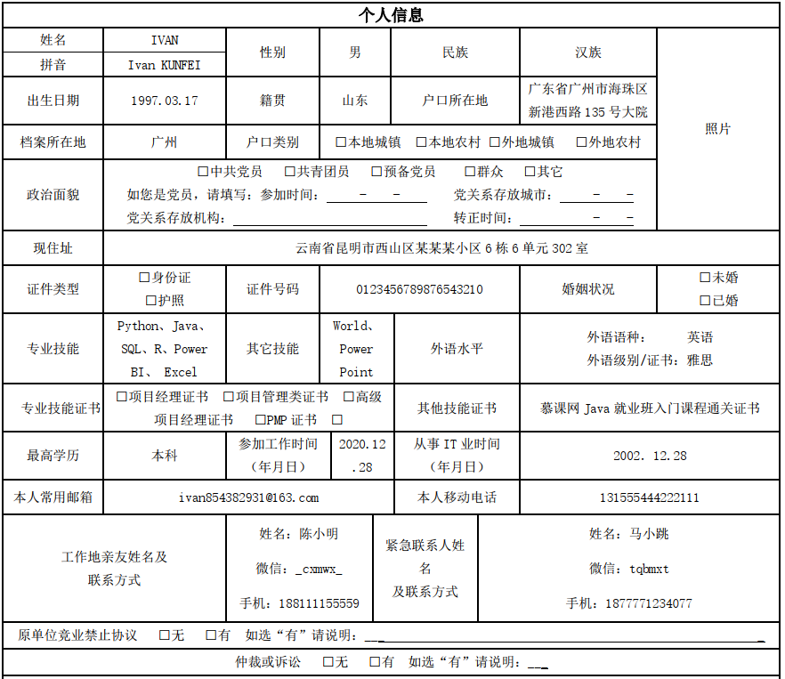
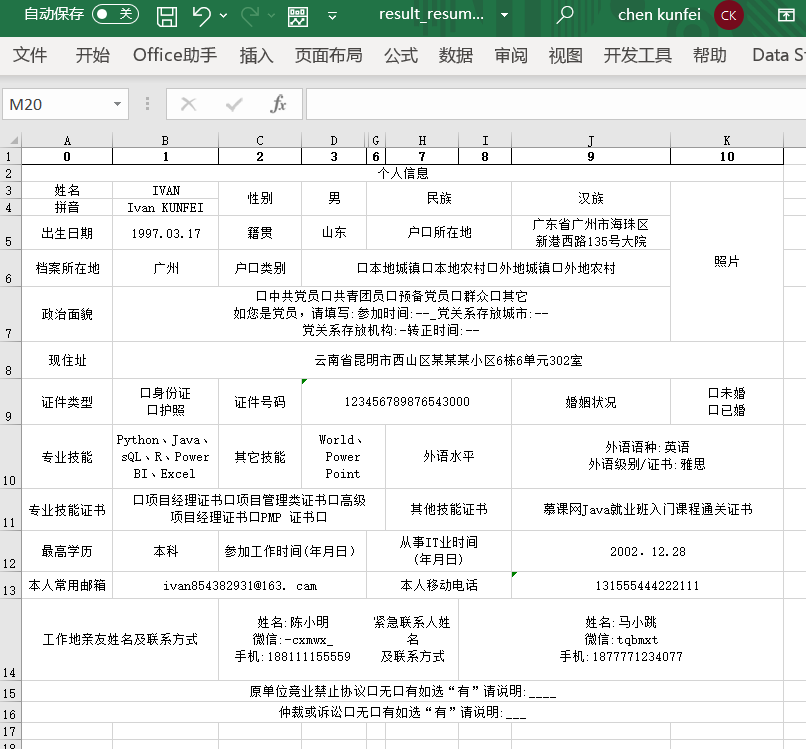
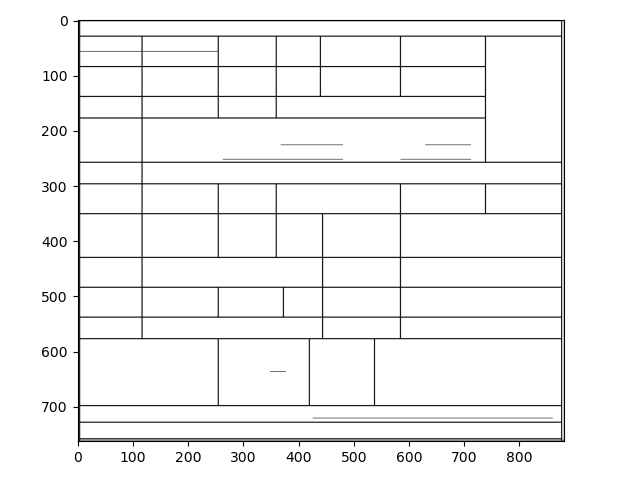
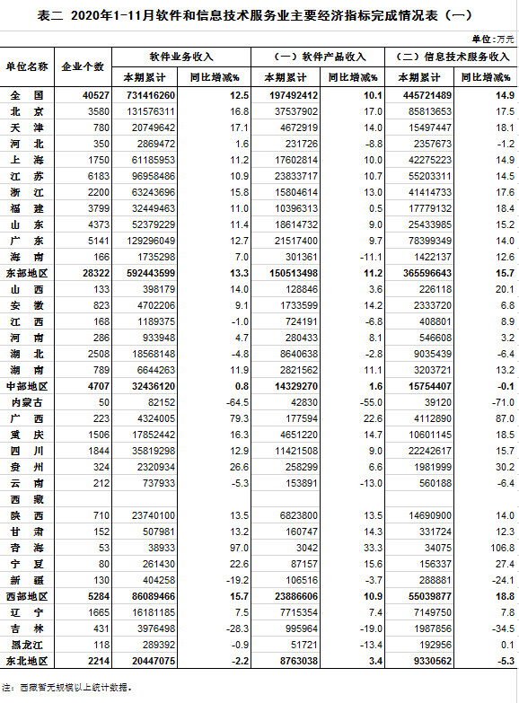
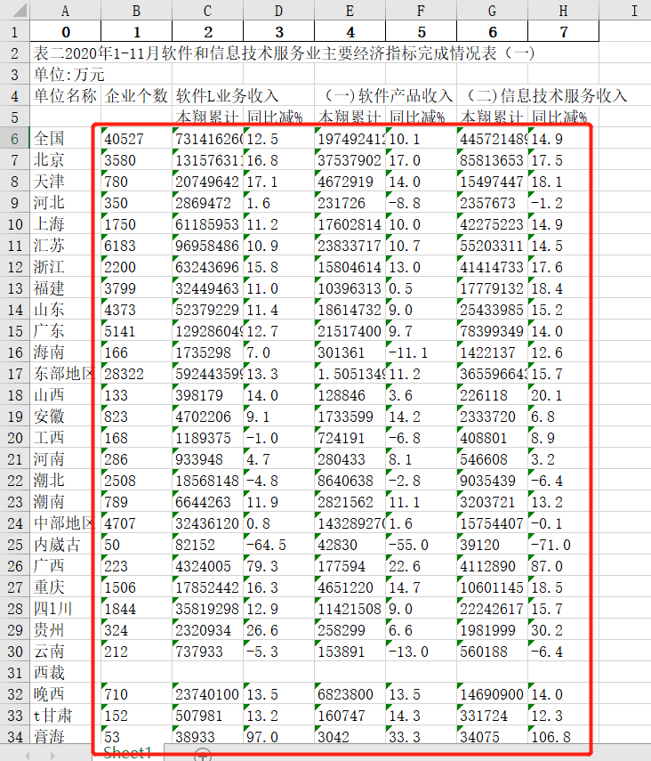

### Table OCR ###
This is a project that applies cnocr to achieves the conversion from image to excel file.

Before



After



Line



Before



After



### Introduction ###
``ocr_resume.py`` and ``ocr_dataframe.py`` are two examples for table ocr, you can change the input images path 
to generate new excel file. 

```local_models``` directory contains trained model for ``dataframe.jpg`` with high accuracy for Number Recognition.

``sub_cut_df`` and ``sub_cut_resume`` directory contains sub images split from the input image.
### Prerequisites ###
1. Python3
2. Python-cnocr
3. Python-skimage
4. Python-Numpy
5. Python-Matplotlib

### Author ###
Ivan Chen